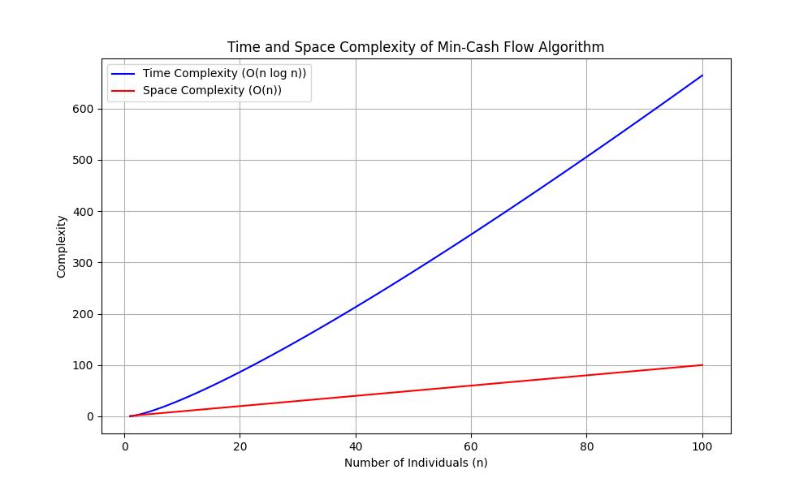

# 💰 ClearSkies - LET'S SETTLE THE DEBT 🚀

Welcome to the ClearSkies, the ultimate toolkit for navigating debt settlement with finesse and efficiency!

## Introduction

Debt settlement can be a daunting task, but fear not! Our team at Hertie School has crafted this comprehensive repository as part of our Data Structures and Algorithms course. Dive in to explore our data, documentation, and analysis, and join us on a journey to financial freedom.

## Demo 🖥️

You can test the live web application [here.](https://clear-sky-debt-settlement-2b44b15cca88.herokuapp.com/login)

## Features ⭐

- Add users to the application
- Create groups and add new members to the group
- Add expenses in the group and let the application handle all the splitting
- When confused about the overall expenses, go and check the Personal and Overall Dashboard

## Folder Structure 📁

```
.
├── .idea
├── app
│   ├── models
│   │   ├── __init__.py
│   │   ├── group.py
│   │   ├── transaction.py
│   │   └── user.py
│   ├── static
│   ├── templates
│   ├── venv
│   ├── __init__.py
│   ├── about.py
│   ├── algorithm_complexity.py
│   ├── auth.py
│   ├── Brainstorming_features.docx
│   ├── config.py
│   ├── debt_resolver.py
│   ├── debts.py
│   ├── domain_hosting_research.rtf
│   ├── forms.py
│   ├── get_user_balances.py
│   └── home.py
├── Debt_Settlement
│   ├── env
│   ├── models
│   └── version4.ipynb
├── instance
│   └── site.db
├── migrations
├── tests
│   ├── test_models
│   ├── test_routes
│   ├── __init__.py
│   └── conftest.py
├── .gitignore
├── identifier.sqlite
├── README.md
├── requirements.txt
└── run.py
```

## Time ⏳ and Space 🌌 Complexity of the Application 

**1. Problem Setup:** In the context of our application, suppose we have a group of users who have engaged in financial transactions, where some owe money to others. The goal is to settle these debts to minimise the total number of transactions, making the process efficient and straightforward.

**2. Structure Utilized:** The key structure in this problem is the representation of debts and credits between users in the form of an adjacency matrix. This matrix is a powerful tool for visualizing and computing net balances between all pairs of users. The adjacency matrix representation allows the algorithm to quickly access and update the debt relationships between individuals.

**3. Algorithm Analysis:**
- Building the Adjacency Matrix: Each cell in the matrix represents the net amount owed by one user to another. Constructing this matrix involves iterating over all transactions, which is $O(n)$, where n is the total number of transactions.
- Min-Cash Flow Algorithm: The implemented solution uses two priority queues (heaps), one for creditors and one for debtors, to efficiently find and settle the largest debts and credits. This method is derived from the algorithm to minimize cash flow among a given set of friends who have borrowed money from each other.

**4. Algorithm Complexity:**

Time Complexity: $O(nlogn)$ ⏳
- Constructing Queues: $O(n log n)$. This complexity arises as each individual is potentially inserted into the heap (either minQ or maxQ based on whether they are a net debtor or creditor).
- Solving Transactions: $O(n log n)$. Each transaction involves removing the top from a heap (either minQ or maxQ), which takes $O(n log n)$ per operation, and potentially this occurs for nearly all individuals.

Space Complexity: $O(n)$ 🌌
- Queues: $O(n)$. The space is required to hold all individuals across the two priority queues.
- Amount Array: $O(n)$. This array is used to calculate the net balance for each individual, which is essential for determining who owes and who is owed.



## How to Use ClearSkies ☁️

1. Clone this repository to your local machine.
2. Explore the data and documentation to gain insights into debt settlement strategies.
3. Implement the algorithms and methodologies in your own projects to tackle debt with confidence.

## List of Contributors 👥
- Varvara Ilyina
- Ray Hossain
- Nima Thing
- Miriam Runde
- Henry Baker
- Benjamin Ayida
- Aditya Narayan Rai
